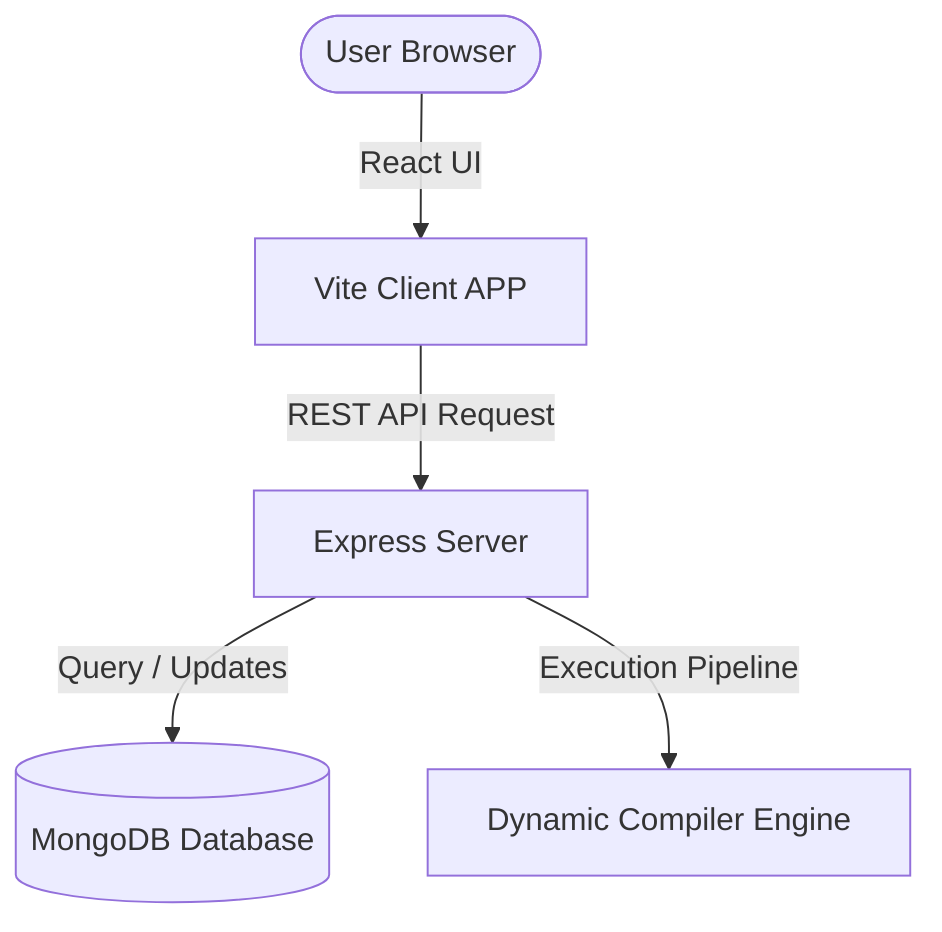

# CodeVibe Codebase Architecture Overview

This document outlines the high-level design patterns, repository structure, and data flows within the CodeVibe project.

---

## 1. Architectural Model

CodeVibe is built as a split-architecture Web Application:
* **Frontend**: Powered by **React 18** and **Vite** as the build engine. Standard styling uses standard Vanilla CSS with premium flex/grid layouts.
* **Backend**: Powered by **Node.js** and **Express**, storing user records, tracking logs, and code evaluation metadata in a NoSQL **MongoDB** cluster.
* **Sandbox Compiling**: Client-submitted code (JavaScript, C, and HTML/CSS) is executed via a sandboxed evaluation engine.

---

## 2. Directory Layout and Responsibilities

### Client Layout (`/client`)
* `src/components/`: Modular frontend views representing lessons, compiler panels, profile settings, and roadmaps.
* `src/context/`: Core states like User Sessions, Progress records, and UI themes.
* `src/utils/`: HTTP helper frameworks built on Axios, format helpers, and token storage handlers.

### Server Layout (`/server`)
* `index.js`: Main entry point setting up server configurations, CORS limits, and database connections.
* `routes/`: Express routers dispatching requests to controllers.
* `models/`: Mongoose schemas outlining models for User, Lesson, and Progress tracking.
* `middleware/`: Authentication checks (JWT parsing) and input validation filters.
* `services/`: Code evaluation engines handling execution loops and security sandboxes.

---

## 3. Core Pipelines

### A. Submitting Code for Evaluation
1. User writes code in the **Code Editor** (`Compiler.jsx`).
2. Code is sent via `POST /api/compiler/submit` to the backend.
3. The backend execution engine spawns sandboxed executors or validates JS solutions directly.
4. Results are matched against dynamic test cases.
5. If successful, points are updated and progress is logged in the `Progress` collection.
